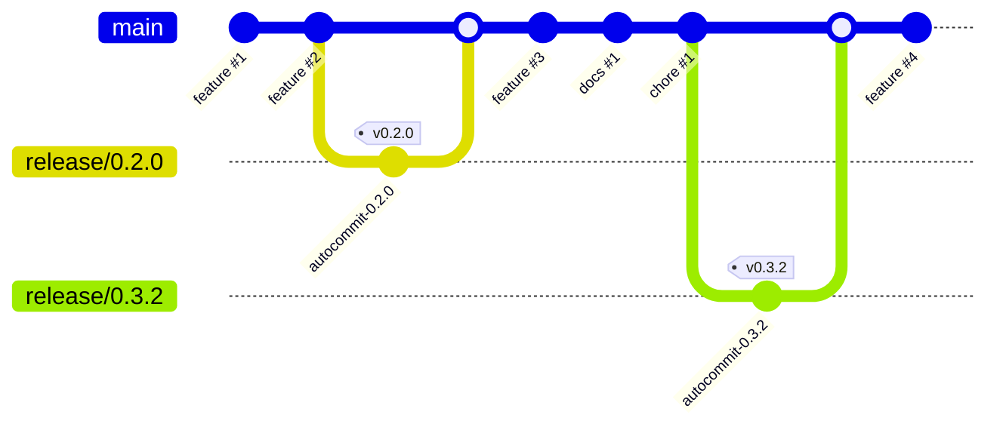

# Conventions

## Git Branches
We recommend using the `main` branch to its fullest by following a slightly modified version of the [GitHub Flow](https://docs.github.com/en/get-started/using-github/github-flow) which allows for `release` branches!
Here's a visual representation of it.



- Development is done on short-lived `feature` branches (~1–3 days), which are then merged into the `main` branch when ready. Otherwise, serious problems arise when trying to merge.
- Pull requests must be reviewed and the [CI](../.github/workflows/ci.yaml) must pass before merge.
- The release process is handled automatically by manually triggering the [release workflow](../.github/workflows/release.yml). It creates a new `release` branch, assigns a `tag`, does a GitHub Release and creates a merge pull request (with automatic merging) to `main`.

> [!IMPORTANT]
> When a hotfix is required, you must create a branch from the `release` branch and create a pull request.
> When a commit is merged on the `release` branch, the [hotfix workflow](../.github/workflows/hotfix.yml) takes care of tagging and releasing.
> Here's a visual example of a hotfix workflow:
> ```mermaid
> gitGraph LR:
>    commit id: "feature #1"
>    commit id: "feature #2"
>    branch "release/0.2.0"
>    checkout "release/0.2.0"
>    commit id: "autocommit-0.2.0" tag: "v0.2.0"
>    checkout main
>    merge "release/0.2.0"
>    commit
>    checkout "release/0.2.0"
>    branch "hotfix-0.2.0/fix-name"
>    checkout "hotfix-0.2.0/fix-name"
>    commit id: "fix #1"
>    checkout "release/0.2.0"
>    merge "hotfix-0.2.0/fix-name" tag: "v0.2.1"
>    checkout main
>    merge "release/0.2.0"
>    commit
> ```

To prevent `main` from being undeployable, three layers of security are present:
1) **Pre-commits:** Ensure that the code quality is appropriate.
2) **Code reviews:** Ensure the code logic aligns with the deliverables.
3) **CI workflow**: Ensure the code doesn't yield any errors.

## Tagging
Tagging must be done when a release is made.
The tags follow the [Semantic Versioning](https://semver.org/) format, and it's structured as follows:

```text
major.minor.path, such as 1.16.2
```

The release workflow uses the commit messages to bump the tags.

### Commit Message
Commit messages should reflect the type of changes.
Hence, we enforce their structure via a pre-commit.
The commit message structure follows the [Conventional Commits](https://www.conventionalcommits.org) structure, which looks as follows:

```text
<type>(optional scope): <description>
```
where,
- `<type>` must be one of `fix`, `feat`, `build`, `chore`, `ci`, `docs`, `style`, `refactor`, `perf`, `test`.
  - Note that `feat` will bump the `minor` version while others will bump the `patch` version.
- `(optional scope)`: can be the JIRA ticket number, for example. It must be in parentheses.
- `<description>`: clear detail of the changes.

Note that if a `!` is appended after the type/scope, it will be considered a breaking change and bump the `major` version (e.g.: `feat!: lorem ipsum`).

> [!TIP]
> We highly recommend squashing the commit messages for readability.

For more information and supported functionalities, see the [official documentation](https://www.conventionalcommits.org).

## Branch naming
The branch name should follow this structure:

```text
<type>/[Optional JIRA ticket number]-[kebab-case-title]
```
where,
- `<type>`: refers to the same [Commit Message's](#commit-message) types.
- `[optional scope]`: refers to the same [Commit Message's](#commit-message) optional scope.
- `[kebab-case-title]`: short and descriptive title (e.g., `added-api-oauth`).
